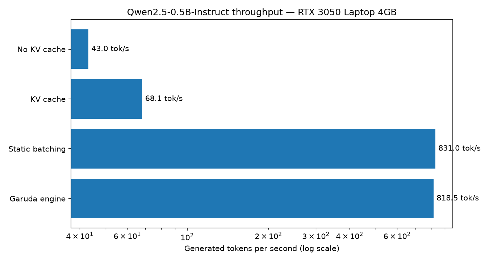
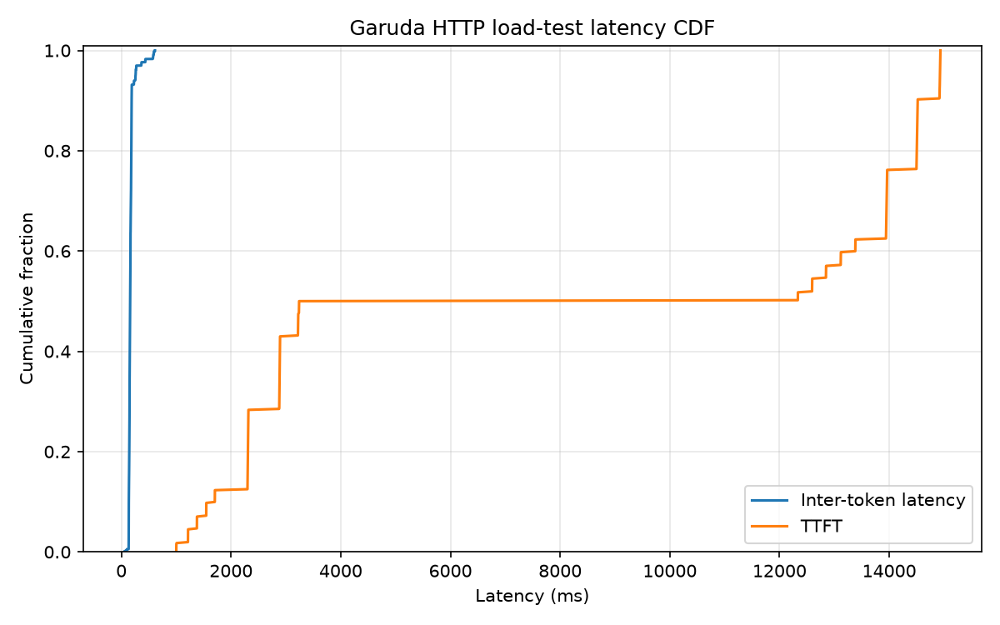

# shrike

An LLM inference engine built from scratch in pure PyTorch — no vLLM, no
flash-attn, no custom CUDA. Loads Qwen2.5-0.5B-Instruct safetensors directly
and serves it over an async HTTP API with the same core machinery as
production engines:

- **KV cache** — the textbook decode optimization
- **Paged KV cache** — block-table memory management (PagedAttention, [vLLM, SOSP '23](https://arxiv.org/abs/2309.06180))
- **Continuous batching** — iteration-level scheduling ([Orca, OSDI '22](https://www.usenix.org/conference/osdi22/presentation/yu))
- **Chunked prefill** — token-budget steps so long prompts can't stall decodes ([Sarathi-Serve, OSDI '24](https://arxiv.org/abs/2403.02310))
- **Prefix caching** — hash-chained block reuse across requests (vLLM v1 APC / [RadixAttention](https://arxiv.org/abs/2312.07104))
- **Async serving layer** — FastAPI + asyncio, SSE token streaming, hundreds of concurrent requests multiplexed onto one GPU decode loop

Everything measured on a **4GB RTX 3050 Laptop GPU** — memory pressure is the
point: paging matters most when VRAM is scarce.

## Results

All rungs run the same seeded variable-length workload (32–256 output tokens
per request, greedy, HF transformers bf16 as the baseline implementation):

| Rung | Configuration | tok/s | vs rung 1 |
|---|---|---|---|
| 1 | HF, no KV cache, batch=1 (full-prefix recompute) | 43.0 | 1× |
| 2 | HF, KV cache, batch=1 | 68.1 | 1.6× |
| 3 | HF, static batching (64 reqs, padded to longest) | 831.0 useful (1477 raw) | 19.3× |
| 4 | **shrike** (paged KV + continuous batching + chunked prefill) | **818.5** | **19.0×** |

Two honest observations, because benchmarks that only flatter are worthless:

- **Static batching ties the engine (±1.5%) on this workload** — all 64
  requests fit in one batch, which is static batching's best case. Its raw
  throughput (1477 tok/s) is 44% padding waste decoding rows that already
  hit their target length; continuous batching backfills that waste, which
  is why the *useful* numbers converge. The engine's win is everything
  static batching cannot do at all: requests arriving over time, streaming,
  per-request lengths, admission control.
- **The ~19× is against a recompute-everything baseline** on short-ish
  generations; it grows with sequence length (the recompute cost is
  quadratic). The vLLM-comparable number is rung 4 vs rung 2: **~12×**.

**Load test** — 512 concurrent streaming HTTP clients, single burst, 64
tokens each, `max_running=256`:

| metric | value |
|---|---|
| success | 512/512, 0 failures, 0 preemptions |
| aggregate throughput | **1302 tok/s** (25.2s wall) |
| TTFT | p50 7.8s · p99 15.0s (burst queueing behind admission control) |
| inter-token latency | p50 162ms · p99 613ms |
| prefix cache hit rate | 95.5% (shared chat-template preamble) |

**Speculative decoding** (`spec_ngram=2`): on repetition-friendly output
(echo/summarize/extract), 26 → 140 tok/s single-stream (**5.4×**) with 100%
draft acceptance and provably identical outputs; on non-repetitive text it
degrades gracefully toward baseline.

### Feature ablation (with vs without each technology)

Offline toggles (`python -m bench.ablation`, same 64-prompt workload) and
serving A/Bs (`bench.load_gen --long-every 8 --stagger-s 8`, 128 concurrent,
every 8th request a ~1,600-token prompt):

| Technology | Without | With | Verdict |
|---|---|---|---|
| KV cache (bs=1) | 43.0 tok/s | 68.1 tok/s | 1.6× (grows with length) |
| Continuous batching | 68.1 tok/s | 818 tok/s | **12×** |
| Prefix caching, short prompts | 842 tok/s | 807 tok/s | ~4% hashing overhead |
| Prefix caching, shared long prefixes | — | 97% block reuse | TTFT 853ms → 96ms (CLI multi-turn) |
| Chunked prefill (staggered long prompts) | TTFT p99 1370ms · ITL p99 99.5ms | TTFT p99 952ms · ITL p99 68.6ms | **−31% tail latency**, equal throughput |
| N-gram speculation, general chat | 807 tok/s | 584 tok/s (27% acceptance) | −28%: drafts mostly rejected |
| N-gram speculation, repetitive output | 26 tok/s | 140 tok/s (≥92% acceptance) | **5.4×** |

The two-sided rows are the point: prefix caching costs a little on cache-cold
short prompts and pays hugely on shared prefixes; speculation is a bet on
output repetitiveness that loses on general chat — which is exactly why
production engines make both toggleable per deployment.




## Architecture

```
HTTP (FastAPI, SSE)  ──►  AsyncEngine (asyncio bridge, per-request queues)
                                 │ background task
                                 ▼
                          LLMEngine.step()
                 schedule ─► forward ─► sample ─► stream
                    │            │
             Scheduler       ModelRunner
      (continuous batching,  (flat token batch, paged
   chunked prefill budget,    attention: scatter K/V to
   preemption, FCFS admit)    block pool + gather/SDPA)
                    │            │
              BlockManager   PagedKVBackend
       (free list, refcounts,  [L, 2, slots, H_kv, D]
        prefix-cache hashes)      bf16 KV pool
```

- One `step()` = one flat `[N_tokens]` forward mixing decodes (1 token/seq)
  and prefill chunks, capped by a token budget (Sarathi). Dense layers don't
  care about sequence boundaries; only attention reads the batch metadata.
- Block size 16; blocks are ref-counted and content-hashed
  (`h_i = hash(h_{i-1}, tokens_i)`), so shared prompt prefixes are served
  from cache with zero recompute.
- Preemption = discard-and-recompute (free victim's blocks, requeue).

### Profiling (py-spy flame graphs)

`bench/results/flame_offline.svg` (engine hot path, 3× offline workload) and
`bench/results/flame_serving.svg` (server during four consecutive
256-concurrent load runs — warm engine sustains ~1,700 tok/s). The measured
Python-side costs, as fractions of total samples:

| Hot path | ~% | What a production engine does instead |
|---|---|---|
| eager RoPE math (fp32 outer/cat/cos/sin per step) | 9% | fused into the attention kernel |
| paged block gather + grouped-einsum decode attention | 10% | fused paged-attention CUDA kernel reads block tables in-kernel |
| K/V scatter into the block pool (`index_copy_`) | 5% | fused into the same kernel |
| per-layer Python op dispatch (24 layers × ~12 ops × every step) | large | CUDA graphs replay the whole decode step as one launch |

This is the quantified answer to "why is vLLM faster than a pure-PyTorch
engine": not the scheduling design (same algorithms), but kernel fusion and
launch elimination.

### Head-to-head vs vLLM (same GPU, same harness, same workload)

vLLM 0.10.2 serving the identical Qwen2.5-0.5B bf16 snapshot on the same
RTX 3050 4GB (`--enforce-eager`, protocol in `bench/compare_vllm.md`),
driven by the identical load generator: 256 streaming requests × 64 forced
tokens, burst-open. Zero failures on all three servers.

| | aggregate tok/s | TTFT p99 | inter-token p99 |
|---|---|---|---|
| vLLM 0.10.2 | **3,445** | **893ms** | **94ms** |
| shrike (Triton decode kernel) | 1,739 | 5,057ms | 778ms |
| shrike (einsum decode) | 1,524 | 3,819ms | 780ms |

**The gap is 2.0× — and the flame graphs above account for it.** vLLM fuses
RoPE/RMSNorm/attention into CUDA kernels, runs its scheduler in optimized
code, and batches sampling natively; shrike pays Python dispatch on all of
it. Writing the Triton paged-attention decode kernel closed part of the
distance (+14% here, +27% offline) and demonstrates the path: each remaining
Python hot spot is a fusion candidate. Losing to a 50-contributor production
engine by 2× with ~1,500 lines of readable Python is the trade this project
chose on purpose — the scheduling algorithms are the same; the kernels are
the moat.

### Honest limitations

Attention gathers each sequence's KV blocks into a contiguous tensor before
`scaled_dot_product_attention` — a production engine reads the block table
inside a fused paged-attention kernel instead. That's the deliberate
trade-off for readable pure-PyTorch code; the scheduler/memory-manager
design is unchanged by it. Future work: Triton paged-attention kernel,
CUDA graphs for decode steps, draft-model speculative decoding.

## Run it

```bash
uv venv .venv && uv pip install -p .venv/bin/python --torch-backend=auto torch && uv pip install -p .venv/bin/python -e .
.venv/bin/python scripts/download_model.py
.venv/bin/python -m pytest tests/ -x        # parity vs HF + paging correctness
.venv/bin/python -m shrike.server.api       # serve on :8000
curl -N localhost:8000/v1/completions -H 'content-type: application/json' \
  -d '{"prompt": "Explain paged attention briefly.", "stream": true, "max_tokens": 128}'
```

Benchmarks: `python -m bench.baselines --rung 1|2|3`, `python -m bench.bench_engine`,
`python -m bench.load_gen --concurrency 512`, `python -m bench.plots`.

## Interactive CLI

Run `python -m shrike.cli --model models_cache/qwen2.5-0.5b-instruct`.
Type `/help` in the REPL to see the available commands.
It streams multi-turn chat with sampling controls, metrics, prefix caching, and speculation.
